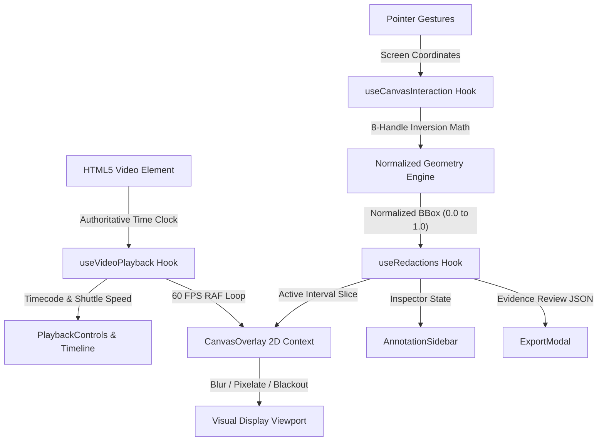

# canvas-redact

> **High-performance, frame-accurate React + HTML5 Canvas video scrubber for evidence bounding box redaction and forensic timeline annotation.**

[](https://github.com/mikev-lab/canvas-redact/actions/workflows/ci.yml)
[](https://mikev-lab.github.io/canvas-redact/)
[](https://www.w3.org/WAI/WCAG21/quickref/?levels=aaa)
[](https://github.com/mikev-lab/canvas-redact)
[](https://www.typescriptlang.org/)
[](LICENSE)

---

> 🚀 **Live Interactive Demo:** [https://mikev-lab.github.io/canvas-redact/](https://mikev-lab.github.io/canvas-redact/)  
> *(Runs 100% client-side with zero install: loads an in-memory procedural CCTV evidence clip automatically on initial visit)*

---

## Executive Overview

**canvas-redact** is a lightweight, zero-external-dependency React and HTML5 Canvas application built for public safety agencies, forensic investigators, legal counsel, and computer vision annotation teams. It provides sub-millisecond, frame-accurate video playback with real-time 60 FPS privacy redaction filters (Gaussian blur, mosaic pixelation, and opaque blackout).

Engineered specifically for evidence handling, **canvas-redact** operates **100% client-side** inside the browser. Media files are processed locally via native HTML5 video and offscreen canvas buffers. Zero bytes of video data are ever transmitted across a network, ensuring complete chain-of-custody privacy.

---

## Key Capabilities

* **100% Client-Side & Air-Gapped:** Zero telemetry, zero analytics tracking, and zero remote network requests. Media files never leave the local browser environment.
* **Frame-Accurate Video Engine & Multi-Rate Ingestion:** Synchronized to native video hardware clocks supporting standard 30 FPS, 24 FPS (film/cinematic), 25 FPS (PAL), 50/60 FPS (high-speed bodycams/dashcams), and low-FPS surveillance media (1, 5, 10, 12, and 15 FPS CCTV systems).
* **Real-Time 60 FPS Redaction Canvas:**
  * **Gaussian Defocus Blur:** Soft privacy blur applied via hardware-accelerated 2D context filtering.
  * **Mosaic Pixelation:** Spatial subsampling rendered using an offscreen scratch buffer with nearest-neighbor interpolation.
  * **Solid Blackout:** Complete opaque censor masking with centered metadata labels.
* **Normalized Video Space $[0.0, 1.0]$:** All bounding box coordinates are calculated and stored as fractional ratios relative to intrinsic video dimensions, ensuring display invariance across responsive resizing, full-screen mode, and letterbox pillarboxing.
* **8-Point Handle Transformation Geometry:** Interactive resize handles with automatic coordinate inversion math when dragged past opposing boundaries.
* **Multi-Track Forensic Timeline:** Drag-and-seek playhead, calibrated time ruler, visual interval validity bars, and draggable In/Out point marker brackets.
* **Forensic Shuttle & Keyboard Controls:** Industry-standard video editing navigation (`Space`, `J/K/L` shuttle speeds from -4x to 4x, 1-frame steppers, 30-frame jumps, `[` and `]` in/out markers).
* **Evidence Review Import & Export Schema (`v1.0.0`):** Bi-directional evidence manifest handling (export and import) with defense-in-depth label sanitization, coordinate clamping, and automatic timestamp ordering.
* **Client-Side Face Tracking & Auto-Redaction Architecture:** Designed for local, zero-network facial detection and re-identification trajectories using in-browser WebAssembly/WebGPU runtimes.
* **Procedural Synthetic CCTV Evidence Generator:** Generates a 10-second mock evidence clip directly in memory ($1280 \times 720$ at 30 FPS) with burnt-in timecode and moving targets for immediate offline testing.
* **WCAG 2.1 Level AAA Accessibility:** Enhanced $\ge 7:1$ contrast against obsidian surfaces, visible high-contrast focus rings, full keyboard operability without a mouse, multi-modal indicator coding, and ARIA live regions.

---

## Forensic Keyboard Shortcuts

| Shortcut | Action | Description |
| :--- | :--- | :--- |
| `Space` | Play / Pause | Toggle continuous video playback |
| `J` | Shuttle Reverse | Accelerate reverse playback (-1x, -2x, -4x) via RAF seeking |
| `K` | Shuttle Pause | Pause playback (0x) |
| `L` | Shuttle Forward | Accelerate forward playback (1x, 2x, 4x) |
| `Left Arrow` | Step Back 1 Frame | Step backward exactly 1 frame (33.33ms at 30 FPS) |
| `Right Arrow` | Step Forward 1 Frame | Step forward exactly 1 frame (33.33ms at 30 FPS) |
| `Shift + Left Arrow` | Jump Back 1 Second | Seek backward 30 frames (1000ms) |
| `Shift + Right Arrow` | Jump Forward 1 Second | Seek forward 30 frames (1000ms) |
| `[` | Set In-Point | Mark beginning timestamp (`startMs`) for selected box |
| `]` | Set Out-Point | Mark ending timestamp (`endMs`) for selected box |
| `Tab` / `Shift + Tab` | Cycle Selection | Navigate focus through active bounding boxes |
| `Delete` / `Backspace` | Delete Redaction | Remove the currently selected annotation box |
| `Escape` | Deselect / Cancel | Deselect active box, cancel active drag, or close modals |
| `?` | Shortcuts Cheat Sheet | Open accessible keyboard hotkeys dialog |

*Note: Global keyboard shortcuts are automatically bypassed when focusing inside text inputs or textareas.*

---

## Architecture & Technical Design



For complete mathematical formulations, coordinate transformations, and filter algorithms, see the [Architecture Specification](docs/ARCHITECTURE.md).

---

## Evidence Export Contract (`v1.0.0`)

Exported redaction manifests validate against the public safety evidence review schema:

```json
{
  "version": "1.0.0",
  "metadata": {
    "source": "canvas-redact",
    "videoName": "bodycam_incident_04.mp4",
    "durationMs": 14200,
    "dimensions": { "width": 1920, "height": 1080 },
    "exportedAt": "2026-09-06T00:30:00.000Z"
  },
  "redactions": [
    {
      "id": "redact-1725580000000",
      "label": "Suspect Face",
      "type": "blur",
      "startMs": 1200,
      "endMs": 5400,
      "bbox": [0.42, 0.18, 0.14, 0.22]
    }
  ]
}
```

---

## Getting Started

### Prerequisites
* Node.js 18.0 or higher
* npm 9.0 or higher

### Installation & Local Development

```bash
# Clone the repository
git clone https://github.com/mikev-lab/canvas-redact.git
cd canvas-redact

# Install dependencies deterministically
npm ci

# Start local development server
npm run dev
```

Open [http://localhost:5173](http://localhost:5173) in your browser. The application will automatically generate and load the procedural synthetic CCTV evidence clip on first launch.

### Verification & Testing

```bash
# Run strict TypeScript diagnostics
npm run typecheck

# Run full Vitest automated test suite
npm test

# Build production bundle
npm run build
```

---

## Technology Stack

* **UI Framework:** React 18 + TypeScript (Strict Mode)
* **Build Tooling:** Vite + PostCSS
* **Styling & Design System:** Tailwind CSS (Obsidian dark theme, WCAG 2.1 AAA contrast ratios)
* **Graphics & Video Engine:** Native HTML5 `<video>` and `<canvas>` 2D Context (Zero external player dependencies)
* **Icons:** `lucide-react`
* **Test Harness:** Vitest + React Testing Library + `@testing-library/jest-dom`

---

## Forensic Privacy & Zero-Telemetry Guarantee

1. **Air-Gapped Execution:** The application does not include any third-party telemetry, analytics scripts, crash trackers, or external API endpoints.
2. **Local Memory Governance:** Media uploaded to the application is loaded into browser memory via local Object URLs (`URL.createObjectURL`), which are immediately revoked (`URL.revokeObjectURL`) when changing media or unmounting.
3. **Data Sanitization:** All user-supplied labels are sanitized against cross-site scripting (XSS) vectors before canvas rendering or DOM display.

---

## License

MIT License. See [LICENSE](LICENSE) for details.
