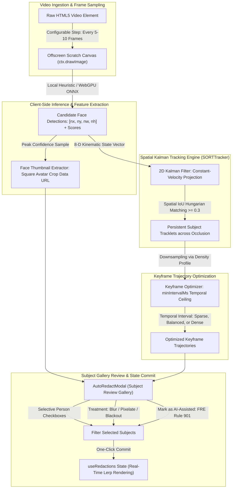

# Client-Side Computer Vision, Spatial Kalman Tracking & Zero-Lump Architecture

> **Components:** `src/ai/detector.ts`, `src/ai/tracker.ts`, `src/ai/faceExtractor.ts`, `src/components/AutoRedactModal.tsx`  
> **Target Audience:** Machine Learning Engineers, Frontend Systems Architects & Computer Vision Developers  
> **Master Architecture:** [docs/ARCHITECTURE.md](ARCHITECTURE.md)

---

## 1. Executive Summary

A core operational requirement in modern evidence processing is the ability to automatically identify, track, and redact moving individuals across long video recordings. However, conventional automated redaction platforms rely on centralized cloud APIs (e.g. AWS Rekognition, Google Cloud Video Intelligence).

For public safety agencies, court proceedings, and corporate investigations, transmitting sensitive media to cloud endpoints is frequently prohibited by statutory privacy regulations (CJIS, HIPAA, GDPR) and introduces high bandwidth costs and upload delays.

**canvas-redact** solves this with an entirely in-browser, **100% client-side computer vision architecture**:
1. **Air-Gapped Privacy Invariant:** Zero video frames, face embeddings, or biometric tensors ever leave the local workstation. All compute executes in-browser using WebGPU and WebAssembly.
2. **Pure TypeScript Spatial Tracker (SORT):** Multi-object tracking is driven by a lightweight, zero-dependency 2D Kalman filter coupled with spatial Intersection over Union (IoU) Hungarian association, executing in microseconds per frame.
3. **Zero-Lump Lazy-Loaded Architecture:** The computer vision subsystem is isolated into asynchronous code chunks via `React.lazy()` and dynamic `import()`. Users performing manual scrubbing incur zero download or memory overhead.

---

## 2. Automated Detection & Tracking Pipeline

The automated redaction engine operates through a 5-stage sequential pipeline:



### Stage 1: Offscreen Sampling & Extraction
Rather than evaluating every frame (which would waste compute on redundant static frames), the pipeline samples frames at a configurable temporal interval $\Delta f$ (e.g. every 5 frames for 30 FPS media $\approx 166.7\text{ ms}$). Frames are rendered into an offscreen canvas buffer for inference.

### Stage 2: Face Candidate Detection
The detector identifies candidate bounding boxes $[x, y, w, h] \in [0.0, 1.0]^4$ along with confidence scores $s \in [0.0, 1.0]$. The subsystem provides a deterministic geometric and colorimetric skin detector for instant offline and unit-test execution, with a pluggable interface (`IDetector`) designed for INT8 quantized ONNX models running over WebGPU.

### Stage 3: Multi-Object Tracking via 2D Kalman Filtering (SORT)
To maintain consistent identities as subjects move across the frame or experience brief visual occlusions, the tracker implements the SORT (Simple Online and Realtime Tracking) paradigm in pure TypeScript:
* **State Vector Formulation:** Each active tracklet maintains an 8-dimensional state vector representing the center coordinates, area, aspect ratio, and their respective first-order temporal derivatives (velocities):
  $$\mathbf{x} = [u, v, s, r, \dot{u}, \dot{v}, \dot{s}, 0]^T$$
  where $(u, v)$ is the bounding box center, $s = w \times h$ is the bounding box scale (area), and $r = w / h$ is the aspect ratio.
* **Kalman Predict Step:** Projects the subject position forward into the current frame assuming constant velocity:
  $$\mathbf{x}_{k|k-1} = \mathbf{F} \mathbf{x}_{k-1|k-1}$$
  $$\mathbf{P}_{k|k-1} = \mathbf{F} \mathbf{P}_{k-1|k-1} \mathbf{F}^T + \mathbf{Q}$$
* **Hungarian IoU Association:** Calculates pairwise Intersection over Union (IoU) between predicted tracks and candidate detections:
  $$\text{IoU}(A, B) = \frac{\text{Area}(A \cap B)}{\text{Area}(A \cup B)}$$
  Detections with $\text{IoU} \ge 0.3$ are associated with existing tracks; unassigned detections instantiate new candidate tracks.
* **Kalman Update Step:** Corrects tracklet coordinates using the assigned measurement:
  $$\mathbf{K}_k = \mathbf{P}_{k|k-1} \mathbf{H}^T (\mathbf{H} \mathbf{P}_{k|k-1} \mathbf{H}^T + \mathbf{R})^{-1}$$
  $$\mathbf{x}_{k|k} = \mathbf{x}_{k|k-1} + \mathbf{K}_k (\mathbf{z}_k - \mathbf{H} \mathbf{x}_{k|k-1})$$
  $$\mathbf{P}_{k|k} = (\mathbf{I} - \mathbf{K}_k \mathbf{H}) \mathbf{P}_{k|k-1}$$

### Stage 4: Face Thumbnail Extraction
For every unique tracklet identified, the system extracts a high-resolution, centered square face crop at peak detection confidence. This thumbnail is serialized into a data URL for display in the Subject Gallery review modal.

### Stage 5: Keyframe Trajectory Generation
The tracked positions across frames are synthesized into `RedactionKeyframe` arrays suitable for smooth 60 FPS piecewise linear interpolation (`lerp`) on the main canvas.

---

## 3. Subject Gallery Review Modal (`AutoRedactModal.tsx`)

To give auditors total control over evidence redaction, the application provides an interactive **Subject Gallery** rather than blindly applying censorship:

```
┌────────────────────────────────────────────────────────────────────────┐
│  AI Auto-Redact: Subject Review Gallery                                │
├────────────────────────────────────────────────────────────────────────┤
│  Detected 3 Unique Subjects across 00:00:14:00                         │
│                                                                        │
│  [✓] Select All   [ ] Deselect All     Hardware: WebGPU (Apple Neural) │
│                                                                        │
│  ┌──────────────┐  ┌──────────────┐  ┌──────────────┐                  │
│  │  [Avatar 1]  │  │  [Avatar 2]  │  │  [Avatar 3]  │                  │
│  │  [✓] Person 1│  │  [✓] Person 2│  │  [ ] Person 3│                  │
│  │  Type: [Blur]│  │  Type:[Pixel]│  │  Type: [Blur]│                  │
│  │  Frames: 1-90│  │  Frames:45-90│  │  Frames: 1-30│                  │
│  └──────────────┘  └──────────────┘  └──────────────┘                  │
│                                                                        │
│  [✓] Mark as AI-Assisted (Legal Audit Trail)                           │
│  Keyframe Density: [ Balanced (~2.5/s) ▼ ]                             │
│                                                                        │
│  [ Cancel ]                                     [ Apply 2 Redactions ] │
└────────────────────────────────────────────────────────────────────────┘
```

### Granular Operator Controls
1. **Per-Subject Selective Redaction:** Checkboxes allow the redactor to select ONLY specific individuals to censor throughout the video while leaving victims, bystanders, or officers untouched.
2. **Individual Treatment Selection:** Each detected individual can independently receive Blur, Pixelation, or Blackout censorship.
3. **AI-Assisted Legal Attribution:** An explicit toggle marks committed redactions as `aiAssisted: true` in the export manifest, satisfying Federal Rules of Evidence (FRE Rule 901) for courtroom transparency.

---

## 4. Keyframe Density Profiles & Temporal Explosion Ceilings

### The Problem of Keyframe Crowding
A naive tracking algorithm generating keyframes on every single video frame produces 1,800 keyframes per minute at 30 FPS. Dense keyframe arrays overwhelm human auditors, bloat JSON manifests, and make manual inspection or micro-adjustments nearly impossible.

### Configurable Density Profiles
**canvas-redact** downsamples tracked trajectories using configurable density profiles with strict temporal ceilings:

| Profile | Min Interval (`minIntervalMs`) | Min Movement Delta | Ideal Use Case |
| :--- | :--- | :--- | :--- |
| **Sparse** | $800\text{ ms}$ (~1 keyframe/s) | $\ge 5.0\%$ of frame | Slow movement, straight-line walking, static scenes |
| **Balanced** (Default) | $400\text{ ms}$ (~2.5 keyframes/s) | $\ge 2.5\%$ of frame | Standard bodycam footage with natural camera movement |
| **Dense** | $200\text{ ms}$ (~5 keyframes/s) | $\ge 1.2\%$ of frame | Rapid tactical maneuvers, erratic motion, sports |

### The Temporal Ceiling Guarantee
Regardless of camera shake or detection noise, keyframe emissions strictly obey the `minIntervalMs` ceiling:

$$\Delta t_{\text{keyframe}} \ge \text{minIntervalMs}$$

This ensures that the resulting timeline is clean, human-auditable, and lightweight.

---

## 5. Zero-Lump Bundle & Lazy-Loading Architecture

To maintain a sub-second First Contentful Paint (FCP) and keep the core video scrubber bundle under $200\text{KB}$ gzipped:
1. **Component Code-Splitting:** `AutoRedactModal.tsx` is wrapped in `React.lazy()` with `<React.Suspense fallback={null}>`:
   ```typescript
   const AutoRedactModal = React.lazy(
     () => import('./components/AutoRedactModal')
   );
   ```
2. **Dynamic Subsystem Ingestion:** The detector and tracker classes are loaded on demand via dynamic `import()` within the scanning workflow.
3. **Zero Overhead for Manual Users:** Operators performing standard manual video redaction never download or initialize computer vision modules, preserving device memory and network bandwidth.
