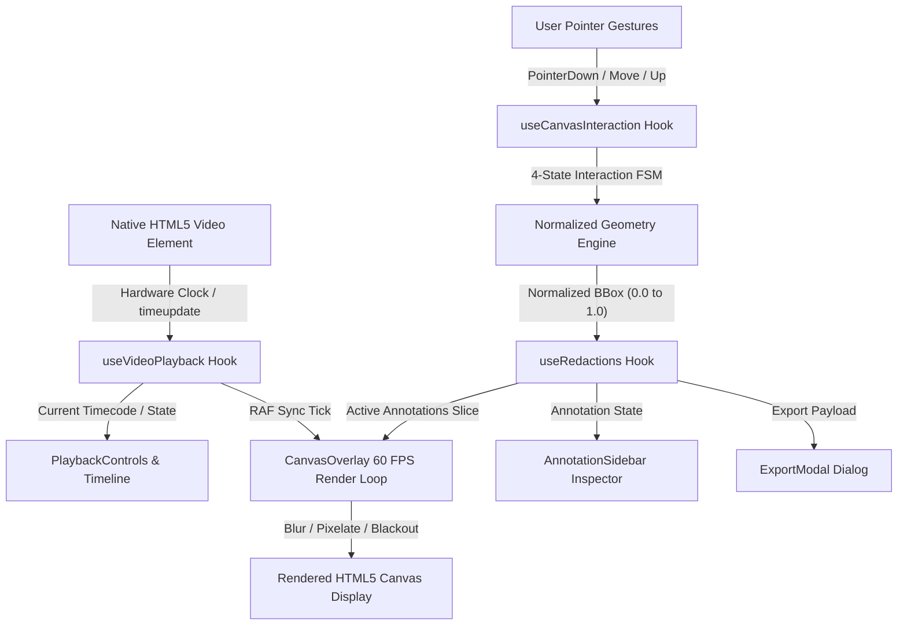
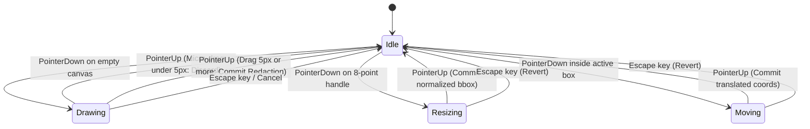

# Architecture Specification: Canvas-Redact

This document outlines the technical architecture, mathematical foundations, rendering pipelines, and state machines powering **canvas-redact**: a high-performance, frame-accurate HTML5 Canvas and React video scrubber engineered for privacy redaction, court evidence review, and computer vision workflows.

---

## 1. System Topology & Data Flow

The application follows a unidirectional reactive architecture where the native HTML5 `<video>` element acts as the authoritative hardware clock. Bounding box coordinates and time intervals are isolated into custom hooks, ensuring that high-frequency timeline updates and 60 FPS canvas rendering do not trigger unnecessary DOM re-renders.



### Key Subsystems
1. **Authoritative Video Clock (`useVideoPlayback`):** Synchronizes playhead position, playback rate (0.25x to 2x), and bi-directional forensic shuttle speeds (-4x to 4x) using `requestAnimationFrame`.
2. **Temporal Annotation State (`useRedactions`):** Maintains the collection of `RedactionBox` objects and dynamically slices active boxes where $startMs \le currentTimeMs \le endMs$.
3. **Pointer Interaction FSM (`useCanvasInteraction`):** Converts viewport client events into normalized video space, manages 8-point resize handles, and handles coordinate inversion.
4. **2D Canvas Redaction Engine (`CanvasOverlay`):** Renders soft Gaussian blur, mosaic pixelation, opaque blackout boxes, and interactive vectors directly over video frames at 60 FPS.

---

## 2. Coordinate Systems & Mathematical Formulations

To ensure that redaction annotations remain pixel-perfect across responsive displays, full-screen modes, and CSS aspect-ratio letterboxing, all coordinates are calculated and stored in **Normalized Video Space $[0.0, 1.0]$**.

### 2.1 Coordinate Space Transformations

$$\text{Client Space } (px) \quad \longleftrightarrow \quad \text{Canvas Buffer Space } (px \times DPR) \quad \longleftrightarrow \quad \text{Normalized Video Space } [0.0, 1.0]$$

#### Screen to Normalized Transformation
Given a pointer event with viewport coordinates $(clientX, clientY)$ and the canvas bounding client rect $R = (\text{left}, \text{top}, \text{width}, \text{height})$:

$$nx = \frac{clientX - R.\text{left}}{R.\text{width}}, \qquad ny = \frac{clientY - R.\text{top}}{R.\text{height}}$$

$$nx_{\text{clamped}} = \max(0.0, \min(1.0, nx)), \qquad ny_{\text{clamped}} = \max(0.0, \min(1.0, ny))$$

#### Normalized to Screen Transformation
Converting a normalized bounding box $[nx, ny, nw, nh]$ back to canvas display pixels for vector outline rendering:

$$x_{\text{screen}} = nx \times R.\text{width}, \qquad y_{\text{screen}} = ny \times R.\text{height}$$

$$w_{\text{screen}} = nw \times R.\text{width}, \qquad h_{\text{screen}} = nh \times R.\text{height}$$

### 2.2 High-DPI / Retina Backing Store Scaling
To prevent blurriness on Retina and high-DPI displays, the backing store buffer resolution is scaled by `window.devicePixelRatio` ($DPR$) while preserving CSS layout dimensions:

$$\text{Buffer Width} = \text{round}(R.\text{width} \times DPR), \qquad \text{Buffer Height} = \text{round}(R.\text{height} \times DPR)$$

Before each RAF frame render, the 2D graphics context scales coordinates by $DPR$:
`ctx.setTransform(DPR, 0, 0, DPR, 0, 0);`

### 2.3 Boundary Inversion & Normalization Math
When a user drags an 8-point resize handle past an opposing edge (e.g., dragging the Top-Left handle below and to the right of the Bottom-Right handle), the width or height becomes negative. The coordinate engine automatically re-normalizes the origin without jumping or throwing arithmetic errors:

$$\text{originX} = \begin{cases} x + width & \text{if } width < 0 \\ x & \text{otherwise} \end{cases}, \qquad \text{normalizedWidth} = |width|$$

$$\text{originY} = \begin{cases} y + height & \text{if } height < 0 \\ y & \text{otherwise} \end{cases}, \qquad \text{normalizedHeight} = |height|$$

### 2.4 Micro-Drag Threshold
Single clicks or accidental jitter under $5\text{px}$ Euclidean distance are discarded to prevent zero-dimension bounding boxes:

$$d = \sqrt{(clientX_1 - clientX_0)^2 + (clientY_1 - clientY_0)^2} < 5\text{px} \implies \text{Discard Gesture}$$

---

## 3. 2D Canvas Redaction Filter Pipelines

Redaction filters are executed directly on the canvas buffer in real time at 60 FPS without external WebAssembly dependencies.

### 3.1 Gaussian Defocus Blur
Applies a soft Gaussian blur filter directly to the bounding box region:
1. Save canvas graphics context: `ctx.save()`.
2. Define rectangular clipping path matching the screen bounding box:
   `ctx.beginPath(); ctx.rect(x, y, w, h); ctx.clip();`
3. Configure GPU filter: `ctx.filter = 'blur(12px)'`.
4. Sample current video frame: `ctx.drawImage(video, 0, 0, width, height)`.
5. Restore context: `ctx.restore()`.

### 3.2 Spatial Mosaic Pixelation
Generates discrete censorship mosaic blocks by downsampling the target region onto a reusable offscreen scratch canvas with image smoothing disabled:
1. Target downsample block size: $S = 8\text{px}$ (scaled to bounding box dimension).
2. Draw target video region scaled down to scratch buffer:
   `scratchCtx.drawImage(video, sx, sy, sw, sh, 0, 0, blocksX, blocksY);`
3. Disable bicubic interpolation:
   `ctx.imageSmoothingEnabled = false;`
4. Upscale scratch buffer back onto main canvas region:
   `ctx.drawImage(scratchCanvas, 0, 0, blocksX, blocksY, x, y, w, h);`

### 3.3 Opaque Blackout Censor
Renders an impenetrable privacy mask for sensitive identifiers:
1. Render solid opaque rectangle:
   `ctx.fillStyle = '#000000'; ctx.fillRect(x, y, w, h);`
2. Render sanitized label badge (e.g., `[REDACTED]` or `[SUSPECT FACE]`) with centered forensic font typography.

---

## 4. Pointer Interaction Finite State Machine

Canvas pointer interactions follow a strict 4-state deterministic finite state machine (FSM):



### Event Listener Lifecycle
To maximize performance and prevent memory leaks:
* `pointermove` and `pointerup` listeners are bound to `window` only during active transitions (`drawing`, `resizing`, `moving`).
* Listeners are unconditionally detached upon `pointerup`, `pointercancel`, `Escape` key, or component unmount.

---

## 5. Playback Engine & Timecode Synchronization

### 5.1 Frame-Accurate Stepping
Standard forensic video frames are stepped according to frame-rate standards:

$$\Delta t_{\text{frame}} = \frac{1000}{\text{fps}} \text{ ms} \quad (\approx 33.33\text{ ms for } 30\text{ FPS})$$

Stepping forward or backward calculates discrete target timestamps:

$$t_{\text{target}} = \text{round}\left(\frac{t_{\text{current}} + \Delta \text{frames} \times \Delta t_{\text{frame}}}{\Delta t_{\text{frame}}}\right) \times \Delta t_{\text{frame}}$$

### 5.2 IEEE 754 Floating-Point Drift Prevention
To prevent cumulative sub-millisecond drift during long playback sessions, continuous playback timestamps are rounded to integer milliseconds ($t_{\text{integer}} = \text{round}(t_{\text{ms}})$).

### 5.3 Bi-Directional J/K/L Forensic Shuttle
* `J` (Reverse): Cycles through shuttle speeds: $-1\text{x} \to -2\text{x} \to -4\text{x}$.
  - Because native HTML5 `<video>` elements do not support negative `playbackRate`, reverse playback is driven via high-frequency RAF frame seeking ticks:
    $$t_{n+1} = \max\left(0, t_n + \text{rate} \times \Delta t_{\text{elapsed}}\right)$$
* `K` (Pause): Halts playback ($0\text{x}$).
* `L` (Forward): Cycles through forward speeds: $1\text{x} \to 2\text{x} \to 4\text{x}$ using native video `playbackRate`.

---

## 6. Evidence Review JSON Export Contract

Exported redaction manifests conform to the public safety evidence review contract (`v1.0.0`):

```typescript
export interface ExportPayload {
  version: '1.0.0';
  metadata: {
    source: 'canvas-redact';
    videoName: string;
    durationMs: number;
    dimensions: {
      width: number;
      height: number;
    };
    exportedAt: string; // ISO 8601 timestamp
  };
  redactions: Array<{
    id: string;
    label: string;
    type: 'blur' | 'pixelate' | 'blackout';
    startMs: number;
    endMs: number;
    bbox: [number, number, number, number]; // [nx, ny, nw, nh]
  }>;
}
```

### Defense-in-Depth Sanitization on Import
Before injecting imported JSON into state:
1. Structural schema validation checks required fields and ranges.
2. Label sanitization strips HTML tags, control characters, and `<script>`/`<style>` blocks.
3. Coordinate values are strictly clamped to $[0.0, 1.0]$.
4. Inverted timestamps are automatically ordered ($startMs \le endMs$).

---

## 7. Forensic Standards & WCAG 2.1 Level AAA Compliance

To satisfy Section 508 and federal court evidence review standards:
1. **Enhanced Contrast Ratio ($\ge 7:1$):**
   - Obsidian surface (`#09090b`), high-contrast text (`#ffffff` and `#f4f4f5` $> 12:1$), and secondary labels (`#d4d4d8` $> 7.5:1$).
2. **Visible High-Contrast Focus Rings:**
   - Universal `focus-visible:ring-2 focus-visible:ring-blue-500 focus-visible:ring-offset-2` on all interactive elements.
3. **Full Keyboard Operability:**
   - 100% of workflows (playback, scrubbing, in/out adjustments, box selection, export) are executable without a mouse.
4. **Multi-Modal Indicator Coding:**
   - Redaction modes couple color accents with textual names and distinct vector iconography.
5. **Screen Reader Live Regions:**
   - State updates are broadcast to assistive technology via `aria-live="polite"`.
6. **Air-Gapped Forensic Privacy:**
   - Zero telemetry, zero network tracking, and 100% client-side memory safety with guaranteed Object URL revocation.

---

## 8. Local Client-Side Face Tracking & Automated Redaction Architecture

To streamline the redaction of long evidence videos containing moving individuals while preserving the air-gapped forensic privacy invariant, **canvas-redact** is designed to support local, zero-network facial tracking.

### 8.1 100% Client-Side WebAssembly / WebGPU Invariant
* Face detection models and feature embedders execute locally within the client browser using WebAssembly or WebGPU acceleration.
* Zero video frames, biometric vectors, or annotations are ever transmitted over external networks.

### 8.2 Tracking & Association Pipeline
1. **Keyframe Sampling:** Video frames are sampled at discrete intervals onto an offscreen scratch canvas.
2. **Face Detection & Landmark Extraction:** The local model detects candidate face bounding boxes $[nx, ny, nw, nh]$ and returns confidence scores.
3. **Target Enrollment Vector:** When an operator identifies a subject to redact, the system extracts a facial embedding vector $\mathbf{b} \in \mathbb{R}^{128}$.
4. **Temporal Re-Identification:** In subsequent frames, candidate faces are matched against the enrolled target using cosine similarity combined with spatial Kalman filter projections:

$$
\text{similarity}(\mathbf{a}, \mathbf{b}) = \frac{\mathbf{a} \cdot \mathbf{b}}{\|\mathbf{a}\| \|\mathbf{b}\|}
$$

   where $\mathbf{a}$ represents the candidate face embedding vector and $\mathbf{b}$ represents the target enrolled embedding vector.
5. **Timeline Interval Creation:** Matched trajectories are synthesized into standard `RedactionBox` entries with validity windows $[startMs, endMs]$.

### 8.3 Keyframe Downsampling & Timeline Explosion Ceilings
To prevent dense 30+ keyframe/sec explosions that overwhelm human auditors, detected trajectories are downsampled with configurable density profiles and strict temporal rate ceilings:
* **Sparse (~1 keyframe/sec):** Minimum interval 800ms between keyframes.
* **Balanced (~2 keyframes/sec):** Minimum interval 400ms between keyframes (default).
* **Dense (~4 keyframes/sec):** Minimum interval 200ms between keyframes.
* **Ceiling Guarantee:** Keyframe emissions strictly respect `minIntervalMs`, guaranteeing that high-frequency motion never crowds the timeline or complicates manual inspection.

### 8.4 Dynamic Code-Splitting & Lazy Loading Architecture
To maintain instantaneous sub-second initial load times and prevent large 50MB+ bundle lumps:
* The Subject Gallery review modal is code-split via `React.lazy()` with `<React.Suspense fallback={null}>`.
* The face detector and multi-object tracker are loaded asynchronously via dynamic `import()` within the scanning workflow.
* Users engaging in manual scrubbing or annotation incur zero network or memory overhead for computer vision modules until launching an auto-redaction scan.

---

## 9. Multi-Rate Frame Ingestion Architecture (24, 25, 30, 50, 60 FPS & Low-FPS Media)

Forensic evidence media encompasses diverse capture rates, from high-speed patrol car dashcams to low-frame-rate commercial CCTV surveillance DVRs.

### 9.1 Supported Media Capture Standards
* **24 FPS:** Cinematic / high-end bodycam media ($\Delta t_{\text{frame}} \approx 41.667\text{ ms}$)
* **25 FPS:** European PAL broadcast and municipal CCTV ($\Delta t_{\text{frame}} = 40.000\text{ ms}$)
* **30 FPS:** Standard NTSC, mobile evidence, and bodycam systems ($\Delta t_{\text{frame}} \approx 33.333\text{ ms}$)
* **50 FPS & 60 FPS:** High-speed tactical camera systems ($\Delta t_{\text{frame}} = 20.000\text{ ms}$ and $\approx 16.667\text{ ms}$)
* **Low-FPS Surveillance Systems:**
  - 1 FPS ($\Delta t_{\text{frame}} = 1000\text{ ms}$)
  - 5 FPS ($\Delta t_{\text{frame}} = 200\text{ ms}$)
  - 10 FPS ($\Delta t_{\text{frame}} = 100\text{ ms}$)
  - 12 FPS ($\Delta t_{\text{frame}} \approx 83.333\text{ ms}$)
  - 15 FPS ($\Delta t_{\text{frame}} \approx 66.667\text{ ms}$)

### 9.2 Adaptive Stepping Math
Single frame stepping dynamically scales to the active media FPS:

$$\Delta t_{\text{step}} = \frac{1000}{\text{fps}} \text{ ms}$$

$$t_{\text{target}} = \text{round}\left(\frac{t_{\text{current}} + \Delta \text{frames} \times \Delta t_{\text{step}}}{\Delta t_{\text{step}}}\right) \times \Delta t_{\text{step}}$$

### 9.3 Low-FPS Scrubbing & Timeline Optimization
* Media with $\text{fps} < 15$ dynamically shifts the timeline ruler division ticks to whole-second markers ($1\text{s}, 2\text{s}, 5\text{s}, 10\text{s}$), preventing tick crowding.
* Frame-stepping hotkeys (`Left/Right` arrow) accurately jump to the nearest recorded video keyframe.
* The evidence review manifest records `metadata.fps`, ensuring frame-accurate chain-of-custody reproducibility during court proceedings.

---

## 10. Dynamic Keyframe Trajectories & Piecewise Linear Interpolation (`lerp`)

To redact moving objects (such as walking suspects, running bystanders, or vehicles traveling across the frame) without popping or requiring disjointed static boxes, **canvas-redact** implements continuous piecewise linear interpolation (`lerp`) across bounding box coordinates in normalized video space $[0.0, 1.0]$.

### 10.1 Keyframe Data Model

Each redaction box optionally contains a chronological sequence of spatial keyframes:

$$K = \{(t_0, \mathbf{b}_0), (t_1, \mathbf{b}_1), \dots, (t_m, \mathbf{b}_m)\}, \quad \text{where } t_i < t_{i+1}$$

where each bounding box $\mathbf{b}_i = [x_i, y_i, w_i, h_i] \in [0.0, 1.0]^4$.

### 10.2 Interpolation Formulation

For any active playback timestamp $t \in [\text{startMs}, \text{endMs}]$:

1. **Boundary Clamping:**
   - If $t \le t_0$, $\text{bbox}(t) = \mathbf{b}_0$.
   - If $t \ge t_m$, $\text{bbox}(t) = \mathbf{b}_m$.

2. **Piecewise Linear Interpolation (`lerp`):**
   - Locate adjacent keyframes $(t_k, \mathbf{b}_k)$ and $(t_{k+1}, \mathbf{b}_{k+1})$ such that $t_k \le t \le t_{k+1}$.
   - Compute normalized interpolation factor:
     $$\alpha = \frac{t - t_k}{t_{k+1} - t_k}, \quad \alpha \in [0.0, 1.0]$$
   - Apply element-wise linear interpolation:
     $$\mathbf{b}(t) = (1 - \alpha)\mathbf{b}_k + \alpha\mathbf{b}_{k+1}$$
   - Clamp all coordinates to $[0.0, 1.0]$:
     $$x(t) = \max(0, \min(1, (1 - \alpha)x_k + \alpha x_{k+1}))$$
     $$y(t) = \max(0, \min(1, (1 - \alpha)y_k + \alpha y_{k+1}))$$
     $$w(t) = \max(0, \min(1 - x(t), (1 - \alpha)w_k + \alpha w_{k+1}))$$
     $$h(t) = \max(0, \min(1 - y(t), (1 - \alpha)h_k + \alpha h_{k+1}))$$

### 10.3 Automatic Anchor Seeding

To prevent unanchored floating box artifacts when an operator adds their first keyframe at $t > \text{startMs}$, the system automatically seeds an initial anchor keyframe at $t = \text{startMs}$ using the box's base coordinates:

$$K_{\text{initial}} = \{(\text{startMs}, \mathbf{b}_{\text{base}}), (t, \mathbf{b}_{\text{new}})\}$$

This guarantees smooth trajectory interpolation from the very start of the segment.

### 10.4 Rapid Censor Tracking Mode (Rotoscoping Workflow)

To minimize operator fatigue during evidence redaction:
* **Toggle Tracking Mode (`T` key):** Activates rapid rotoscoping mode.
* **Keyframe & Step Hotkey (`Space` bar):**
  - When Tracking Mode is enabled and an active box is selected:
    1. Records or updates the keyframe at current playhead position with current bounding box geometry.
    2. Automatically advances playhead forward by `jumpFrames` (e.g. 1 frame, 2 frames, 5 frames, 10 frames, or 30 frames).
  - The operator repositions the box over the target and taps `Space` again.
  - When Tracking Mode is disabled (or no box is selected): `Space` acts as standard forensic Play/Pause toggle.
* **Direct Keyframe Hotkeys:** `Enter` or `M` to record in place, `Alt + Left/Right Arrow` to navigate between keyframes, and `Shift + Left/Right Arrow` to step by custom jump intervals.

### 10.5 Forward-Projected Jump Extension in Tracking Mode

In manual rotoscoping workflows, an operator tracks moving subjects across video frames by marking keyframe coordinates. In conventional video editors with fixed temporal bounds, a bounding box is constrained to a static $[startMs, endMs]$ duration. When an operator advances past $endMs$, the bounding box abruptly terminates, disappearing from the canvas. This interrupts the operator's rotoscoping rhythm, forcing them to pause and manually adjust timeline brackets (via the `]` key or timeline drag handles).

To maintain continuous operator flow without manual boundary adjustments, **canvas-redact** implements an automatic **Forward-Projected Jump Extension** mechanism within `useRedactions` and `App.tsx`:

#### Mathematical Jump Extension Formulation
When Tracking Mode is active and the operator records a keyframe via `Space` (keyframe and step forward), the target jump duration is computed based on the active media framerate and configured frame jump count:

$$\Delta t_{\text{jump}} = \max\left(33, \text{round}\left(\frac{\text{jumpFrames} \times 1000}{\text{fps}}\right)\right)$$

The timestamp of the upcoming landing frame is:

$$t_{\text{next}} = \min(\text{durationMs}, t_{\text{current}} + \Delta t_{\text{jump}})$$

To guarantee that the bounding box does not terminate upon arrival at $t_{\text{next}}$, the system forward-projects the redaction validity ceiling to encompass the landing frame plus the subsequent jump step:

$$t_{\text{projectedEnd}} = \min(\text{durationMs}, \max(\text{endMs}, t_{\text{next}} + \Delta t_{\text{jump}}))$$

#### Monotonic Boundary Enforcement (`minEndMs`)
The `useRedactions.setKeyframe` action accepts an optional `minEndMs` parameter. When updating the target annotation record, the hook enforces monotonic expansion of the temporal boundaries:

$$\text{nextStartMs} = \min(\text{startMs}, t_{\text{current}})$$

$$\text{nextEndMs} = \max(\text{endMs}, t_{\text{current}}, \text{minEndMs} \text{ if provided})$$

#### Keyframing Modes
1. **Step-and-Track (`Space`):** Projects the boundary forward to $t_{\text{next}} + \Delta t_{\text{jump}}$ and advances the playhead by `jumpFrames`. When the playhead arrives at $t_{\text{next}}$, the box is guaranteed to remain active and visible. The operator can immediately drag or resize the box and press `Space` again.
2. **In-Place Keyframe (`Enter` or `M`):** When Tracking Mode is enabled, records a keyframe at the current position and forward-projects $endMs$ to at least $t_{\text{current}} + \Delta t_{\text{jump}}$, ensuring coverage extends into the immediate future even without stepping.
3. **Anchor Preservation:** When keyframing on a box with no prior keyframes at $t > startMs$, the initial geometry at $startMs$ is preserved as an anchor, preventing trajectory drift from the origin point.

---

## 11. Decoder-Gated Reverse Playback & Personnel Chain of Custody Attribution

### 11.1 The Hardware Decoder Starvation Problem
HTML5 `<video>` specifications do not support negative playback rates (`playbackRate = -1` or `-2`). Emulated reverse playback via `video.currentTime = targetSec` inside standard 60 FPS `requestAnimationFrame` loops fails in browser rendering engines:
1. Video codecs (H.264, VP9, AV1, HEVC) are forward-predictive. Seeking backward requires the browser to locate the preceding I-frame (keyframe) and decode forward to the target frame.
2. Issuing a new `currentTime` assignment every 16.67ms cancels the pending decode pipeline before completion (`video.seeking === true`), resulting in black screens, frozen frames, or multi-second stalls until playback stops.

### 11.2 Decoder-Gated Seeking Formulation
To guarantee smooth, continuous reverse playback at -1x, -2x, and -4x without freezing:
1. Accumulated wall-clock target time is tracked independently:
   $$t_{\text{target}}(t + \Delta t) = \max(0, t_{\text{target}}(t) - \Delta t \times |R|)$$
2. Seek operations are strictly gated on hardware decoder readiness:
   $$\text{DispatchSeek}(t_{\text{target}}) \iff \neg \text{video.seeking} \land \neg \text{isSeekingRef.current}$$
3. When the browser finishes decoding the target frame, it fires the native `'seeked'` event:
   - `isSeekingRef.current` is cleared.
   - `currentTimeMs` is synchronized to `video.currentTime * 1000`.
   - If the accumulated target time has drifted further backward during the decode, the next seek is dispatched immediately without waiting for the next RAF tick.
4. `CanvasOverlay` synchronizes by keeping its 60 FPS RAF loop active during reverse shuttle (`isPlaying || shuttleRate !== 0`) and binding an immediate `renderFrame()` invocation directly to the `'seeked'` event.

### 11.3 Personnel Chain of Custody (`reviewerId`)
Court evidence standards mandate clear provenance of who applied privacy censorship to media:
* **Reviewer ID Stamping:** The application header provides an operator badge / employee ID input (e.g. `OFC-4921`).
* **Automatic Attribution:** Every newly created redaction automatically inherits the active `reviewerId`.
* **Segment Editing:** Operators can review and adjust the reviewer ID for individual redaction segments in the inspector.
* **Manifest Persistence:** Exported and imported JSON manifests serialize `metadata.reviewerId` and per-box `reviewerId` attributes with defense-in-depth sanitization against XSS and control characters.

---

## 12. Development Thought Process & Architectural Rationale

This section documents the foundational engineering trade-offs, design decisions, and architectural rationales established during the development of **canvas-redact**.

### 12.1 100% Client-Side Air-Gapped Architecture vs. Cloud Processing
* **The Problem:** Video evidence often contains sensitive personal identifiable information (PII), juvenile victims, undercover officers, or proprietary facility recordings. Transmitting multi-gigabyte bodycam or CCTV files to cloud backends introduces substantial legal risks, data security vulnerabilities, CJIS (Criminal Justice Information Services) compliance overhead, and multi-minute upload delays.
* **Options Considered:**
  1. *Server-Side Processing (e.g. Node/Python/FFmpeg API):* Centralized transcoding and filter baking, but introduces severe data egress liability, high cloud hosting costs, and network latency bottlenecks.
  2. *Hybrid Cloud Processing:* Metadata in cloud, video streaming via pre-signed URLs. Still violates air-gapped evidence requirements for sensitive public safety agencies.
  3. *100% Client-Side Browser Engine:* Zero data leaves the local workstation. Video files are parsed in-memory via `URL.createObjectURL(file)`, and censorship layers are rendered directly on the GPU using HTML5 Canvas.
* **Decision & Rationale:** We selected the 100% Client-Side Air-Gapped Architecture. By avoiding network transport entirely, the application guarantees absolute privacy, zero cloud operational expenses, instant drag-and-drop ingestion, and compliance with court evidence chain-of-custody standards.

### 12.2 Normalized Coordinates [0.0, 1.0] vs. Absolute Pixel Coordinates
* **The Problem:** Bounding boxes must remain spatially aligned across diverse display environments, including window resizing, responsive layout shifts, sidebar collapsing, and browser fullscreen modes.
* **Options Considered:**
  1. *Screen Pixel Coordinates ($px$):* Measuring boxes relative to the rendered canvas DOM width and height ($800 \times 450$). Breaks immediately when the viewport resizes, requiring complex scaling transformations across the entire state tree.
  2. *Intrinsic Video Pixel Coordinates:* Measuring boxes relative to the raw video resolution ($1920 \times 1080$). Requires waiting for video metadata before any box can be positioned, couples state to media dimensions, and complicates letterbox/pillarbox offset calculations.
  3. *Normalized Fractional Coordinates $[0.0, 1.0]$:* Measuring coordinates as fractions of the intrinsic video dimensions, where $(0, 0)$ is top-left and $(1, 1)$ is bottom-right.
* **Decision & Rationale:** We selected Normalized Coordinates $[0.0, 1.0]$. Normalized coordinates are completely invariant to CSS dimensions, DPI scaling, and viewport resizing. Furthermore, normalized formats are the universal standard for computer vision annotations (YOLO, COCO, Pascal VOC), allowing exported JSON manifests to integrate directly into machine learning pipelines without conversion.

### 12.3 Native HTML5 Video & 2D Canvas vs. Heavy WebAssembly (FFmpeg WASM)
* **The Problem:** Delivering frame-accurate video playback with high-performance redaction filters without introducing multi-megabyte bundle bloat or CPU rendering lag.
* **Options Considered:**
  1. *FFmpeg WebAssembly (ffmpeg.wasm):* Provides full video demuxing and software transcoding in the browser. However, the core WASM binary exceeds 25MB to 50MB, requires SharedArrayBuffer with complex Cross-Origin Isolation headers (`COOP`/`COEP`), incurs high memory overhead, and struggles to decode high-resolution 4K streams at 60 FPS on standard consumer hardware.
  2. *Third-Party Video Player Libraries (Video.js, Plyr):* Add heavy DOM abstractions and event proxies that decouple the canvas render loop from hardware video ticks, causing frame desynchronization.
  3. *Native HTML5 `<video>` paired with 2D HTML5 `<canvas>`:* Exploits the browser's native hardware-accelerated video decode engine, overlaying an interactive 2D canvas that renders GPU-accelerated CSS filters (`ctx.filter = 'blur(12px)'`) at 60 FPS.
* **Decision & Rationale:** We selected the Native HTML5 `<video>` and 2D `<canvas>` pipeline. This keeps the production application bundle under 200KB gzipped, eliminates external binary dependencies, ensures instantaneous zero-wait startup, and delivers smooth 60 FPS playback on modern workstations.

### 12.4 Event-Driven Decoder-Gated Reverse Seeking vs. Standard RAF Seek Loops
* **The Problem:** Modern video compression formats (H.264, HEVC, AV1) use inter-frame temporal compression with keyframes (I-frames) and predictive frames (P/B-frames). While forward playback is hardware-optimized, HTML5 `<video>` elements do not support negative playback rates. Attempting to implement reverse playback by updating `video.currentTime` inside a standard 60 FPS `requestAnimationFrame` loop rapidly overwhelms the browser's hardware video decoder, leading to dropped frames, black screens, or completely frozen playback.
* **Options Considered:**
  1. *Fixed-Interval Timer Seeking:* Issuing `currentTime` decrements on a `setInterval(..., 33ms)`. Fails because decode latencies vary across frames, leading to queue buildup.
  2. *Full Frame Pre-Extraction into Memory:* Pre-rendering video frames into an in-memory array of canvas bitmaps. Requires gigabytes of RAM for even a few minutes of 1080p video, causing browser tab crashes.
  3. *Decoder-Gated Seeking Pipeline:* Gating backward seeks on decoder readiness (`!video.seeking && !isSeekingRef.current`) and listening directly to the browser's native `'seeked'` event to trigger both canvas redraws and the subsequent frame seek.
* **Decision & Rationale:** We designed the Decoder-Gated Seeking Pipeline. By synchronizing seek dispatches to the hardware decoder's completion event rather than an arbitrary timer, reverse shuttle operates smoothly across -1x, -2x, and -4x speeds without freezing the UI or starving the video decode pipeline.

### 12.5 Piecewise Linear Interpolation (`lerp`) vs. Spline Curves
* **The Problem:** Tracking moving subjects (such as pedestrians or vehicles) across video frames requires coordinate progression between recorded keyframes.
* **Options Considered:**
  1. *Per-Frame Dense Storage:* Storing coordinate values for every single video frame (30 to 60 records per second). Results in bloated export manifests, excessive memory consumption, and extreme difficulty in manually editing or inspecting trajectories.
  2. *Cubic or Catmull-Rom Spline Interpolation:* Generates smooth curved paths. However, splines suffer from overshoot and oscillation artifacts (Runge's phenomenon). A sudden change in subject velocity can cause the interpolated redaction box to swing outside the target's actual path, inadvertently exposing an unredacted face between keyframes (a critical privacy violation).
  3. *Piecewise Linear Interpolation (`lerp`):* Linearly interpolating coordinates between adjacent keyframes in normalized space.
* **Decision & Rationale:** We selected Piecewise Linear Interpolation (`lerp`). Linear interpolation is mathematically monotonic, strictly bounded within the convex hull of consecutive keyframes, computationally instantaneous ($O(1)$ per frame), and forensic-safe with zero overshoot risk.

### 12.6 Rapid Rotoscope Tracking Workflow with Forward-Projected Bounds
* **The Problem:** Redacting moving targets in long video clips is labor-intensive. In traditional non-linear editors, an operator must repeatedly select the box, advance the timeline, stretch the clip duration, position the box, and create a keyframe. This repetitive cycle causes severe operator fatigue and slows evidence turnaround times.
* **Options Considered:**
  1. *Multi-Step Tool Workflow:* Separate tools for drawing, seeking, stretching, and keyframing.
  2. *Tracking Mode with Static Durations:* Hotkey-driven stepping, but with a fixed box duration ($endMs$). When the operator advances past the initial duration, the box vanishes, forcing manual timeline extensions.
  3. *Tracking Mode with Forward-Projected Jump Extension:* An integrated rotoscoping mode where pressing `Space` records the current keyframe, steps forward by a customizable jump interval (e.g. 1, 5, 10, or 30 frames), and automatically forward-projects $endMs$ to cover the landing frame and upcoming jump.
* **Decision & Rationale:** We selected the Tracking Mode with Forward-Projected Jump Extension. The operator can track an object smoothly across dozens of frames simply by holding their mouse over the target and rhythmically tapping `Space`, reducing redaction time from minutes to seconds without any manual timeline fiddling.

### 12.7 Asynchronous Dynamic Code-Splitting for Computer Vision Subsystems
* **The Problem:** While automated face detection and multi-object tracking accelerate bulk redactions, bundling heavy computer vision models into the main application bundle increases initial download size, degrades load performance, and penalizes users who only need manual redaction.
* **Options Considered:**
  1. *Monolithic Bundling:* Including all detection algorithms, tracking logic, and UI modals in the primary index bundle. Results in a large initial payload and slower First Contentful Paint (FCP).
  2. *External CDN Scripts:* Loading models from external CDNs at runtime. Violates the air-gapped forensic privacy invariant.
  3. *Asynchronous Dynamic Code-Splitting:* Isolating the auto-redaction modal (`AutoRedactModal.tsx`), face detectors, and Kalman tracking engine into on-demand asynchronous chunks via `React.lazy()` and dynamic `import()`.
* **Decision & Rationale:** We implemented Asynchronous Dynamic Code-Splitting. The primary video scrubber bundle remains lightweight (sub-second FCP), while computer vision modules are loaded only when the operator explicitly clicks "Auto-Redact".

### 12.8 Pure TypeScript Multi-Object Tracking (SORT + Kalman Filter)
* **The Problem:** Associating detected faces across video frames into consistent subject trajectories requires multi-object tracking. Heavy machine learning tracking models (such as deep feature extractors) consume significant GPU memory and require large model weight downloads.
* **Options Considered:**
  1. *Deep Learning Appearance Re-ID (DeepSORT):* High accuracy, but requires loading heavy neural feature extraction models into memory, leading to thermal throttling on ultra-thin laptops.
  2. *Pure TypeScript SORT (Simple Online and Realtime Tracking):* Combining a 2D spatial Kalman filter for constant-velocity trajectory prediction with spatial Intersection over Union (IoU) Hungarian association.
* **Decision & Rationale:** We implemented a Pure TypeScript SORT Tracker. It executes in microseconds per frame with zero external dependencies, consumes negligible memory, runs smoothly on low-power devices (such as an Apple M4 MacBook Air), and provides stable track continuity across occlusions and motion blur.

### 12.9 Integer Millisecond State Representation vs. Floating-Point Seconds
* **The Problem:** The native HTML5 video element represents time in floating-point seconds (`video.currentTime = 14.283333`). In JavaScript, IEEE 754 floating-point arithmetic introduces cumulative precision drift when performing repetitive frame additions (e.g. $0.1 + 0.2 \ne 0.3$). Over a 60-minute bodycam recording, floating-point drift causes redaction boxes to trigger one frame early or late, compromising evidentiary accuracy.
* **Options Considered:**
  1. *Floating-Point Seconds:* Native to HTML5 `<video>`, but prone to rounding drift and comparison errors (`t >= start && t <= end`).
  2. *Frame Index Integers:* Indexing purely by frame number (0 to $N$). Requires strict knowledge of the exact video framerate and fails when handling variable framerate (VFR) media.
  3. *Integer Milliseconds ($ms$):* Normalizing all internal time representation to discrete integer milliseconds (`Math.round(sec * 1000)`).
* **Decision & Rationale:** We selected Integer Milliseconds ($ms$). Integer arithmetic completely eliminates floating-point precision drift, guarantees deterministic interval comparisons ($startMs \le currentTimeMs \le endMs$), supports both standard and low-framerate media, and aligns with standard forensic video timecode contracts.

### 12.10 Strict WCAG 2.1 Level AAA Forensic Accessibility Standard
* **The Problem:** Evidence review and redaction applications are heavily utilized in public safety, judicial, and municipal government settings governed by federal accessibility standards (Section 508 and ADA Title II). Standard web applications typically target WCAG Level AA, which allows lower contrast ratios and permits mouse-only workflows.
* **Options Considered:**
  1. *Standard WCAG 2.1 Level AA:* Minimum 4.5:1 contrast ratio, basic keyboard focus. Insufficient for demanding low-light command centers or operators with severe vision impairments.
  2. *Strict WCAG 2.1 Level AAA:* Minimum 7:1 enhanced contrast ratio for all standard text and labels, visible high-contrast focus rings, complete keyboard operability for 100% of workflows, ARIA live region announcements for state transitions, and multi-modal indicator coding.
* **Decision & Rationale:** We engineered **canvas-redact** to strictly comply with WCAG 2.1 Level AAA. Using a curated obsidian slate color palette (`#09090b` background with high-contrast `#ffffff` and `#f4f4f5` text), operators enjoy reduced eye strain during multi-hour review sessions, and every action is fully accessible via keyboard shortcuts.


