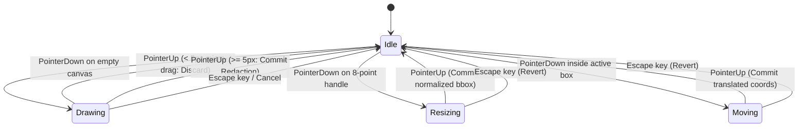

# Architecture Specification: Canvas-Redact

This document outlines the technical architecture, mathematical foundations, rendering pipelines, and state machines powering **canvas-redact**: a high-performance, frame-accurate HTML5 Canvas and React video scrubber engineered for privacy redaction, court evidence review, and computer vision workflows.

---

## 1. System Topology & Data Flow

The application follows a unidirectional reactive architecture where the native HTML5 `<video>` element acts as the authoritative hardware clock. Bounding box coordinates and time intervals are isolated into custom hooks, ensuring that high-frequency timeline updates and 60 FPS canvas rendering do not trigger unnecessary DOM re-renders.

```mermaid
graph TD
    A[Native HTML5 Video Element] -->|Hardware Clock / timeupdate| B[useVideoPlayback Hook]
    B -->|Current Timecode / State| C[PlaybackControls & Timeline]
    B -->|RAF Sync Tick| D[CanvasOverlay 60 FPS Render Loop]
    
    E[User Pointer Gestures] -->|PointerDown / Move / Up| F[useCanvasInteraction Hook]
    F -->|4-State Interaction FSM| G[Normalized Geometry Engine]
    G -->|Normalized BBox [0..1]| H[useRedactions Hook]
    
    H -->|Active Annotations Slice| D
    H -->|Annotation State| I[AnnotationSidebar Inspector]
    H -->|Export Payload| J[ExportModal Dialog]
    
    D -->|Blur / Pixelate / Blackout| K[Rendered HTML5 Canvas Display]
```

### Key Subsystems
1. **Authoritative Video Clock (`useVideoPlayback`):** Synchronizes playhead position, playback rate (0.25x to 2x), and bi-directional forensic shuttle speeds (-4x to 4x) using `requestAnimationFrame`.
2. **Temporal Annotation State (`useRedactions`):** Maintains the collection of `RedactionBox` objects and dynamically slices active boxes where $startMs \le currentTimeMs \le endMs$.
3. **Pointer Interaction FSM (`useCanvasInteraction`):** Converts viewport client events into normalized video space, manages 8-point resize handles, and handles coordinate inversion.
4. **2D Canvas Redaction Engine (`CanvasOverlay`):** Renders soft Gaussian blur, mosaic pixelation, opaque blackout boxes, and interactive vectors directly over video frames at 60 FPS.

---

## 2. Coordinate Systems & Mathematical Formulations

To ensure that redaction annotations remain pixel-perfect across responsive displays, full-screen modes, and CSS aspect-ratio letterboxing, all coordinates are calculated and stored in **Normalized Video Space $[0.0, 1.0]$**.

### 2.1 Coordinate Space Transformations

$$\text{Client Space } (px) \quad \longleftrightarrow \quad \text{Canvas Buffer Space } (px \times DPR) \quad \longleftrightarrow \quad \text{Normalized Video Space } [0.0, 1.0]$$

#### Screen to Normalized Transformation
Given a pointer event with viewport coordinates $(clientX, clientY)$ and the canvas bounding client rect $R = (\text{left}, \text{top}, \text{width}, \text{height})$:

$$nx = \frac{clientX - R.\text{left}}{R.\text{width}}, \qquad ny = \frac{clientY - R.\text{top}}{R.\text{height}}$$

$$nx_{\text{clamped}} = \max(0.0, \min(1.0, nx)), \qquad ny_{\text{clamped}} = \max(0.0, \min(1.0, ny))$$

#### Normalized to Screen Transformation
Converting a normalized bounding box $[nx, ny, nw, nh]$ back to canvas display pixels for vector outline rendering:

$$x_{\text{screen}} = nx \times R.\text{width}, \qquad y_{\text{screen}} = ny \times R.\text{height}$$

$$w_{\text{screen}} = nw \times R.\text{width}, \qquad h_{\text{screen}} = nh \times R.\text{height}$$

### 2.2 High-DPI / Retina Backing Store Scaling
To prevent blurriness on Retina and high-DPI displays, the backing store buffer resolution is scaled by `window.devicePixelRatio` ($DPR$) while preserving CSS layout dimensions:

$$\text{Buffer Width} = \text{round}(R.\text{width} \times DPR), \qquad \text{Buffer Height} = \text{round}(R.\text{height} \times DPR)$$

Before each RAF frame render, the 2D graphics context scales coordinates by $DPR$:

$$\text{ctx.setTransform}(DPR, 0, 0, DPR, 0, 0)$$

### 2.3 Boundary Inversion & Normalization Math
When a user drags an 8-point resize handle past an opposing edge (e.g., dragging the Top-Left handle below and to the right of the Bottom-Right handle), the width or height becomes negative. The coordinate engine automatically re-normalizes the origin without jumping or throwing arithmetic errors:

$$\text{originX} = \begin{cases} x + width & \text{if } width < 0 \\ x & \text{otherwise} \end{cases}, \qquad \text{normalizedWidth} = |width|$$

$$\text{originY} = \begin{cases} y + height & \text{if } height < 0 \\ y & \text{otherwise} \end{cases}, \qquad \text{normalizedHeight} = |height|$$

### 2.4 Micro-Drag Threshold
Single clicks or accidental jitter under $5\text{px}$ Euclidean distance are discarded to prevent zero-dimension bounding boxes:

$$d = \sqrt{(clientX_1 - clientX_0)^2 + (clientY_1 - clientY_0)^2} < 5\text{px} \implies \text{Discard Gesture}$$

---

## 3. 2D Canvas Redaction Filter Pipelines

Redaction filters are executed directly on the canvas buffer in real time at 60 FPS without external WebAssembly dependencies.

### 3.1 Gaussian Defocus Blur
Applies a soft Gaussian blur filter directly to the bounding box region:
1. Save canvas graphics context: `ctx.save()`.
2. Define rectangular clipping path matching the screen bounding box:
   $$\text{ctx.beginPath}(); \quad \text{ctx.rect}(x, y, w, h); \quad \text{ctx.clip}()$$
3. Configure GPU filter: `ctx.filter = 'blur(12px)'`.
4. Sample current video frame: `ctx.drawImage(video, 0, 0, width, height)`.
5. Restore context: `ctx.restore()`.

### 3.2 Spatial Mosaic Pixelation
Generates discrete censorship mosaic blocks by downsampling the target region onto a reusable offscreen scratch canvas with image smoothing disabled:
1. Target downsample block size: $S = 8\text{px}$ (scaled to bounding box dimension).
2. Draw target video region scaled down to scratch buffer:
   $$\text{scratchCtx.drawImage}(video, sx, sy, sw, sh, 0, 0, \text{blocksX}, \text{blocksY})$$
3. Disable bicubic interpolation:
   $$\text{ctx.imageSmoothingEnabled} = \text{false}$$
4. Upscale scratch buffer back onto main canvas region:
   $$\text{ctx.drawImage}(scratchCanvas, 0, 0, \text{blocksX}, \text{blocksY}, x, y, w, h)$$

### 3.3 Opaque Blackout Censor
Renders an impenetrable privacy mask for sensitive identifiers:
1. Render solid opaque rectangle:
   $$\text{ctx.fillStyle} = '\#000000'; \quad \text{ctx.fillRect}(x, y, w, h)$$
2. Render sanitized label badge (e.g., `[REDACTED]` or `[SUSPECT FACE]`) with centered forensic font typography.

---

## 4. Pointer Interaction Finite State Machine

Canvas pointer interactions follow a strict 4-state deterministic finite state machine (FSM):



### Event Listener Lifecycle
To maximize performance and prevent memory leaks:
* `pointermove` and `pointerup` listeners are bound to `window` only during active transitions (`drawing`, `resizing`, `moving`).
* Listeners are unconditionally detached upon `pointerup`, `pointercancel`, `Escape` key, or component unmount.

---

## 5. Playback Engine & Timecode Synchronization

### 5.1 Frame-Accurate Stepping
Standard forensic video frames are stepped according to frame-rate standards:

$$\Delta t_{\text{frame}} = \frac{1000}{\text{fps}} \text{ ms} \quad (\approx 33.33\text{ ms for } 30\text{ FPS})$$

Stepping forward or backward calculates discrete target timestamps:

$$t_{\text{target}} = \text{round}\left(\frac{t_{\text{current}} + \Delta \text{frames} \times \Delta t_{\text{frame}}}{\Delta t_{\text{frame}}}\right) \times \Delta t_{\text{frame}}$$

### 5.2 IEEE 754 Floating-Point Drift Prevention
To prevent cumulative sub-millisecond drift during long playback sessions, continuous playback timestamps are rounded to integer milliseconds ($t_{\text{integer}} = \text{round}(t_{\text{ms}})$).

### 5.3 Bi-Directional J/K/L Forensic Shuttle
* `J` (Reverse): Cycles through shuttle speeds: $-1\text{x} \to -2\text{x} \to -4\text{x}$.
  - Because native HTML5 `<video>` elements do not support negative `playbackRate`, reverse playback is driven via high-frequency RAF frame seeking ticks:
    $$t_{n+1} = \max\left(0, t_n + \text{rate} \times \Delta t_{\text{elapsed}}\right)$$
* `K` (Pause): Halts playback ($0\text{x}$).
* `L` (Forward): Cycles through forward speeds: $1\text{x} \to 2\text{x} \to 4\text{x}$ using native video `playbackRate`.

---

## 6. Evidence Review JSON Export Contract

Exported redaction manifests conform to the public safety evidence review contract (`v1.0.0`):

```typescript
export interface ExportPayload {
  version: '1.0.0';
  metadata: {
    source: 'canvas-redact';
    videoName: string;
    durationMs: number;
    dimensions: {
      width: number;
      height: number;
    };
    exportedAt: string; // ISO 8601 timestamp
  };
  redactions: Array<{
    id: string;
    label: string;
    type: 'blur' | 'pixelate' | 'blackout';
    startMs: number;
    endMs: number;
    bbox: [number, number, number, number]; // [nx, ny, nw, nh]
  }>;
}
```

### Defense-in-Depth Sanitization on Import
Before injecting imported JSON into state:
1. Structural schema validation checks required fields and ranges.
2. Label sanitization strips HTML tags, control characters, and `<script>`/`<style>` blocks.
3. Coordinate values are strictly clamped to $[0.0, 1.0]$.
4. Inverted timestamps are automatically ordered ($startMs \le endMs$).

---

## 7. Forensic Standards & WCAG 2.1 Level AAA Compliance

To satisfy Section 508 and federal court evidence review standards:
1. **Enhanced Contrast Ratio ($\ge 7:1$):**
   - Obsidian surface (`#09090b`), high-contrast text (`#ffffff` and `#f4f4f5` $> 12:1$), and secondary labels (`#d4d4d8` $> 7.5:1$).
2. **Visible High-Contrast Focus Rings:**
   - Universal `focus-visible:ring-2 focus-visible:ring-blue-500 focus-visible:ring-offset-2` on all interactive elements.
3. **Full Keyboard Operability:**
   - 100% of workflows (playback, scrubbing, in/out adjustments, box selection, export) are executable without a mouse.
4. **Multi-Modal Indicator Coding:**
   - Redaction modes couple color accents with textual names and distinct vector iconography.
5. **Screen Reader Live Regions:**
   - State updates are broadcast to assistive technology via `aria-live="polite"`.
6. **Air-Gapped Forensic Privacy:**
   - Zero telemetry, zero network tracking, and 100% client-side memory safety with guaranteed Object URL revocation.

---

## 8. Local Client-Side Face Tracking & Automated Redaction Architecture

To streamline the redaction of long evidence videos containing moving individuals while preserving the air-gapped forensic privacy invariant, **canvas-redact** is designed to support local, zero-network facial tracking.

### 8.1 100% Client-Side WebAssembly / WebGPU Invariant
* Face detection models and feature embedders execute locally within the client browser using WebAssembly or WebGPU acceleration.
* Zero video frames, biometric vectors, or annotations are ever transmitted over external networks.

### 8.2 Tracking & Association Pipeline
1. **Keyframe Sampling:** Video frames are sampled at discrete intervals onto an offscreen scratch canvas.
2. **Face Detection & Landmark Extraction:** The local model detects candidate face bounding boxes $[nx, ny, nw, nh]$ and returns confidence scores.
3. **Target Enrollment Vector:** When an operator identifies a subject to redact, the system extracts a facial embedding vector $\mathbf{v}_{\text{target}} \in \mathbb{R}^{128}$.
4. **Temporal Re-Identification:** In subsequent frames, candidate faces are matched against the enrolled target using cosine similarity combined with spatial Kalman filter projections:
   $$\text{sim}(\mathbf{v}_j, \mathbf{v}_{\text{target}}) = \frac{\mathbf{v}_j \cdot \mathbf{v}_{\text{target}}}{\|\mathbf{v}_j\| \|\mathbf{v}_{\text{target}}\|}$$
5. **Timeline Interval Creation:** Matched trajectories are synthesized into standard `RedactionBox` entries with validity windows $[startMs, endMs]$.

---

## 9. Multi-Rate Frame Ingestion Architecture (24, 25, 30, 50, 60 FPS & Low-FPS Media)

Forensic evidence media encompasses diverse capture rates, from high-speed patrol car dashcams to low-frame-rate commercial CCTV surveillance DVRs.

### 9.1 Supported Media Capture Standards
* **24 FPS:** Cinematic / high-end bodycam media ($\Delta t_{\text{frame}} \approx 41.667\text{ ms}$)
* **25 FPS:** European PAL broadcast and municipal CCTV ($\Delta t_{\text{frame}} = 40.000\text{ ms}$)
* **30 FPS:** Standard NTSC, mobile evidence, and bodycam systems ($\Delta t_{\text{frame}} \approx 33.333\text{ ms}$)
* **50 FPS & 60 FPS:** High-speed tactical camera systems ($\Delta t_{\text{frame}} = 20.000\text{ ms}$ and $\approx 16.667\text{ ms}$)
* **Low-FPS Surveillance Systems:**
  - 1 FPS ($\Delta t_{\text{frame}} = 1000\text{ ms}$)
  - 5 FPS ($\Delta t_{\text{frame}} = 200\text{ ms}$)
  - 10 FPS ($\Delta t_{\text{frame}} = 100\text{ ms}$)
  - 12 FPS ($\Delta t_{\text{frame}} \approx 83.333\text{ ms}$)
  - 15 FPS ($\Delta t_{\text{frame}} \approx 66.667\text{ ms}$)

### 9.2 Adaptive Stepping Math
Single frame stepping dynamically scales to the active media FPS:

$$\Delta t_{\text{step}} = \frac{1000}{\text{fps}} \text{ ms}$$

$$t_{\text{target}} = \text{round}\left(\frac{t_{\text{current}} + \Delta \text{frames} \times \Delta t_{\text{step}}}{\Delta t_{\text{step}}}\right) \times \Delta t_{\text{step}}$$

### 9.3 Low-FPS Scrubbing & Timeline Optimization
* Media with $\text{fps} < 15$ dynamically shifts the timeline ruler division ticks to whole-second markers ($1\text{s}, 2\text{s}, 5\text{s}, 10\text{s}$), preventing tick crowding.
* Frame-stepping hotkeys (`Left/Right` arrow) accurately jump to the nearest recorded video keyframe.
* The evidence review manifest records `metadata.fps`, ensuring frame-accurate chain-of-custody reproducibility during court proceedings.
