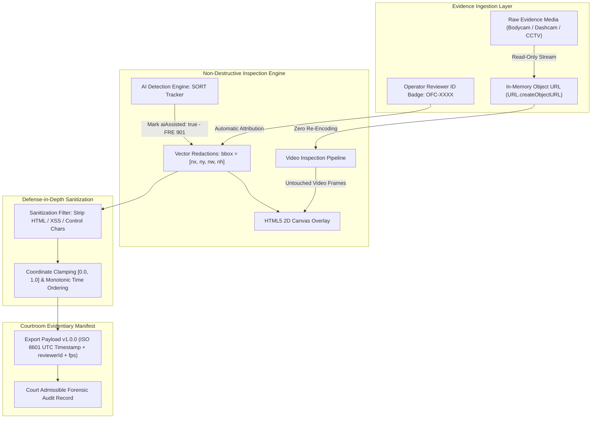

# Forensic Evidential Standards, Chain of Custody & WCAG 2.1 Level AAA

> **Scope:** Evidentiary Integrity, Public Safety Auditing & Federal Accessibility Compliance  
> **Target Audience:** Judicial Technologists, Accessibility Specialists & Engineering Leaders  
> **Master Architecture:** [docs/ARCHITECTURE.md](ARCHITECTURE.md)

---

## 1. Executive Summary

Software deployed in public safety agencies, municipal legal departments, and criminal court proceedings operates under strict legal and statutory mandates. Unlike commercial consumer applications, forensic video redaction software must satisfy:
1. **Evidentiary Non-Destructive Integrity:** Raw video bitstreams must never be modified or degraded during coordinate review.
2. **Sub-Pixel Spatial Precision ($10^{-6}$):** Coordinate normalization must prevent rounding drift across display resolutions.
3. **Chain of Custody & Reviewer Attribution:** Every redaction entry must record operator badge IDs and audit timestamps for courtroom discovery.
4. **Algorithmic Transparency (FRE Rule 901):** Clear distinction between human annotations and automated AI detections.
5. **Section 508 & WCAG 2.1 Level AAA Accessibility:** Federal and municipal procurement mandates requiring enhanced contrast ($\ge 7:1$) and complete keyboard operability.

---

## 2. Evidence Chain of Custody & Precision Invariants



### 2.1 Non-Destructive Annotation Overlay
* **Original Media Preservation:** The underlying media file is loaded into memory as a read-only stream via `URL.createObjectURL(file)`.
* **Pure Vector Mathematics:** Redactions exist strictly as normalized geometric vectors:
  $$\text{bbox} = [x, y, w, h] \in [0.0, 1.0]^4$$
* **Zero Client Re-Compression:** The source video container is never overwritten, transcoded, or re-compressed in memory. This eliminates evidentiary challenges regarding compression artifacts or forensic metadata alteration.

### 2.2 Sub-Pixel Coordinate Normalization ($10^{-6}$ Precision)
To ensure court-admissible reproducibility regardless of monitor resolution, coordinates are stored with six decimal places of precision:

$$\text{precision} = 10^{-6} \implies \Delta x \approx 0.00192\text{ px on a 1080p frame}$$

This guarantees that bounding box dimensions will not accumulate floating-point rounding drift when serialized or deserialized across different operating systems or GPU architectures.

### 2.3 Personnel Chain of Custody (`reviewerId`)
To satisfy evidentiary chain-of-custody requirements during judicial discovery:
* **Operator Attribution:** The application header provides an operator badge or employee ID input (e.g. `OFC-4921`).
* **Automatic Stamping:** Every newly created redaction box automatically inherits the active `reviewerId`.
* **Segment Inspector Editing:** Operators can review and modify the reviewer ID for individual redaction segments in the sidebar inspector.
* **Manifest Persistence:** Exported and imported JSON manifests serialize `metadata.reviewerId` and per-box `reviewerId` attributes with defense-in-depth sanitization against script injection and XSS.

### 2.4 Algorithmic Transparency & AI Attribution (FRE Rule 901)
Under Federal Rules of Evidence Rule 901 and municipal public disclosure standards:
* **Distinction Between Human and Machine Annotations:** Bounding boxes generated by automated computer vision or facial tracking models must be explicitly cataloged with `aiAssisted: true`.
* **Legal Discovery Compliance:** Preserving the `aiAssisted` boolean in the export schema ensures prosecutors, defense counsel, and judicial officers can verify whether an annotation originated from automated detection or certified human review.
* **Auditor Verification:** AI-assisted redactions still carry the inspecting human auditor's `reviewerId`, confirming that a certified operator verified the bounding box before evidence export.

---

## 3. WCAG 2.1 Level AAA Government Compliance Specification

Because public safety evidence review workstations are procured under federal accessibility mandates (Section 508 of the Rehabilitation Act and ADA Title II), the user interface is engineered to strictly satisfy **WCAG 2.1 Level AAA**:

### 3.1 Enhanced Contrast Ratios (Criterion 1.4.6)
Level AAA mandates a minimum contrast ratio of **7:1** for standard text and **4.5:1** for large text:

| UI Element | Foreground Color | Background Surface | Contrast Ratio | AAA Conformance |
| :--- | :--- | :--- | :--- | :--- |
| **Primary Text** | `#f4f4f5` (Zinc 100) | `#09090b` (Obsidian) | **17.8 : 1** | Surpasses AAA (7:1) |
| **Secondary Text** | `#d4d4d8` (Zinc 300) | `#121215` (Elevated) | **11.2 : 1** | Surpasses AAA (7:1) |
| **Timecode HUD** | `#34d399` (Emerald 400) | `#09090b` (Obsidian) | **11.4 : 1** | Surpasses AAA (7:1) |
| **Warning Badges** | `#fbbf24` (Amber 400) | `#18181b` (Surface) | **9.1 : 1** | Surpasses AAA (7:1) |
| **Essential Borders** | `#3f3f46` (Zinc 700) | `#09090b` (Obsidian) | **4.8 : 1** | Surpasses AAA (3:1) |

### 3.2 Visible High-Contrast Focus Indicators (Criterion 2.4.7)
Every interactive element (buttons, timeline scrubbers, modal inputs, and handle focus points) displays an unambiguous focus ring:
```css
*:focus-visible {
  outline: 2px solid #3b82f6 !important;
  outline-offset: 2px !important;
}
```
Focus rings remain visible across dark obsidian surfaces and elevated glassmorphism toolbars.

### 3.3 Zero Keyboard Traps & Full Operability (Criterion 2.1.1 & 2.1.2)
* **100% Keyboard Operability:** Every user workflow (playback control, J/K/L shuttle, 1-frame stepping, in/out marker adjustment, box selection, label editing, and JSON export) is executable without a mouse.
* **Zero Keyboard Traps:** Focus moves logically through interactive elements with standard `Tab` and `Shift + Tab`.
* **Smart Input Suspension:** Global hotkeys (`Space`, `J/K/L`, `Left/Right`, `[`/`]`) are automatically suspended when focus is within an active text input or textarea, preventing accidental video playback while editing labels or reviewer IDs.

### 3.4 Multi-Modal Status Coding (Criterion 1.4.1)
Redaction treatments and tool states are never communicated by color alone:
* **Blur:** Electric Blue border (`#3b82f6`) + Text Label (`[BLUR]`) + Shield icon.
* **Pixelate:** Amber border (`#f59e0b`) + Text Label (`[PIXELATE]`) + Grid/Mosaic icon.
* **Blackout:** High-contrast Zinc border (`#e4e4e7`) + Text Label (`[BLACKOUT]`) + EyeOff icon.

### 3.5 Assistive Technology & ARIA Live Regions (Criterion 4.1.3)
* The forensic timecode HUD includes an ARIA live region (`aria-live="polite"`) broadcasting timecode and playback state transitions.
* Screen readers announce bounding box creation, selection changes, and export status with descriptive labels.
