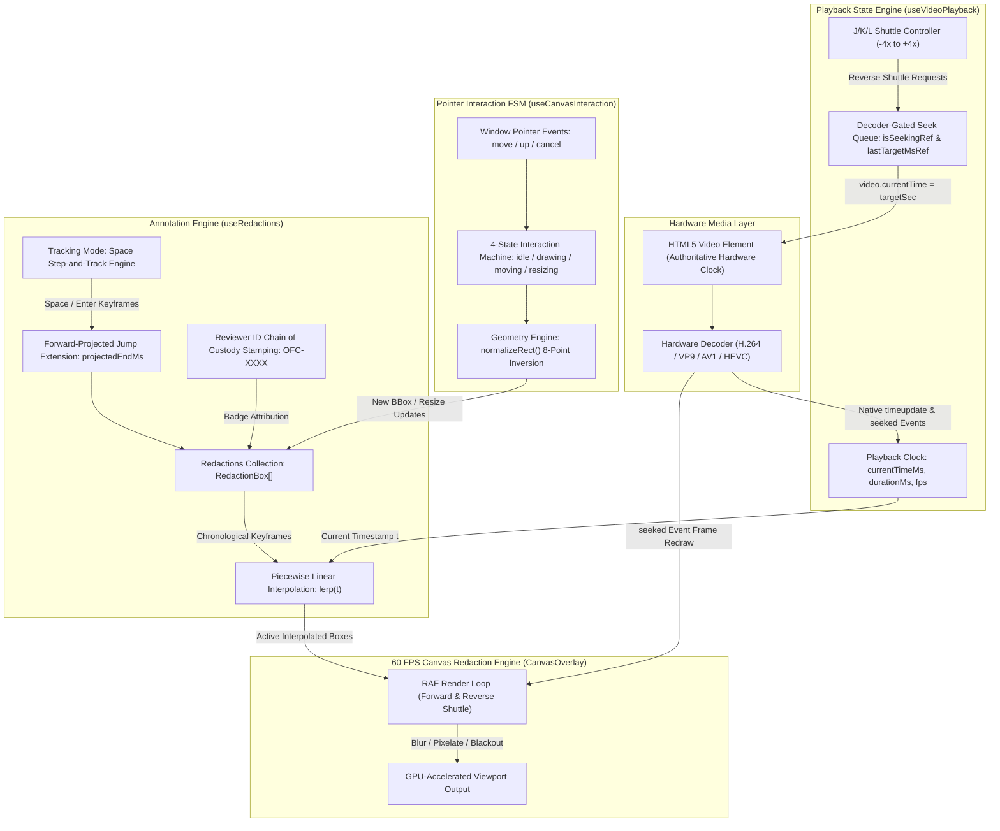
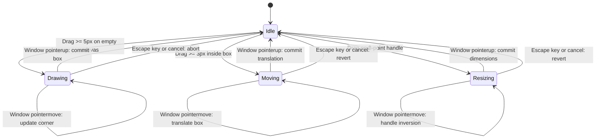

# Reactive Hooks, Interaction State Machines & Lifecycle Governance

> **Components:** `src/hooks/useVideoPlayback.ts`, `src/hooks/useRedactions.ts`, `src/hooks/useCanvasInteraction.ts`  
> **Target Audience:** React Engineers, State Machine Architects & Frontend Developers  
> **Master Architecture:** [docs/ARCHITECTURE.md](ARCHITECTURE.md)

---

## 1. Executive Summary

A critical architectural challenge in browser-based video editing applications is managing rapid state updates without triggering React re-render cascades. In **canvas-redact**, high-frequency state updates occur along two separate axes:
1. **The Media Clock Axis:** At 60 FPS, the video hardware playhead advances every $16.67\text{ ms}$, requiring canvas redraws and timecode synchronization.
2. **The Pointer Gesture Axis:** Dragging, resizing, and drawing on the canvas emit hundreds of pointer events per second.

To decouple high-frequency rendering from React's virtual DOM reconciliation tree:
* The native HTML5 `<video>` element serves as the single hardware source of truth for media time.
* Canvas rendering is driven directly via `requestAnimationFrame` and native `'seeked'` events, completely bypassing React component re-renders during active playback.
* User pointer interactions are encapsulated in a 4-state deterministic Finite State Machine (FSM) that binds mouse events to `window` only during active dragging, guaranteeing zero stuck drag states.

---

## 2. Unidirectional State & Playback Topology



---

## 3. The 4-State Pointer Interaction Finite State Machine

Pointer gestures on the canvas overlay are governed by a deterministic Finite State Machine:



### Event Listener Lifecycle Invariant
To maximize performance and prevent memory leaks:
* `pointermove`, `pointerup`, and `pointercancel` listeners are bound to `window` only during active transitions (`drawing`, `moving`, `resizing`).
* All window listeners are unconditionally detached upon `pointerup`, `pointercancel`, `Escape` keypress, or component unmount.
* This architecture guarantees that if a user drags quickly beyond the canvas boundaries or off the browser window, releasing the mouse button cleanly returns the FSM to `idle` without creating stuck drag states.

---

## 4. Hardware Decoder-Gated Reverse Seeking Pipeline

### 4.1 The Hardware Decoder Starvation Problem
HTML5 `<video>` specifications do not support negative playback rates (`playbackRate = -1` or `-2`). Web video editors attempting to emulate reverse playback by assigning `video.currentTime = targetTime` inside standard 60 FPS `requestAnimationFrame` loops immediately trigger decoder queue starvation:
1. Video codecs (H.264, VP9, AV1, HEVC) are forward-predictive. Seeking backward requires the browser to locate the preceding I-frame (keyframe) and decode forward to the target frame.
2. Issuing a new `currentTime` assignment every $16.67\text{ ms}$ cancels the pending decode pipeline before completion (`video.seeking === true`), resulting in black screens, dropped frames, or completely frozen playback until scrubbing stops.

### 4.2 Event-Driven Decoder-Gated Architecture
To guarantee smooth reverse shuttle at -1x, -2x, and -4x speeds without freezing:

```mermaid
sequenceDiagram
    participant User as Keyboard (J key)
    participant Hook as useVideoPlayback
    participant Video as HTML5 Video Decoder
    participant Canvas as CanvasOverlay (60 FPS)

    User->>Hook: Press J (shuttleRate = -1x)
    Hook->>Hook: Track wall-clock target time: t_target(t + dt)
    alt Decoder Idle: not seeking
        Hook->>Video: video.currentTime = t_target
        Note over Video: Hardware Decoder locates I-frame and decodes forward
    else Decoder Busy: video seeking in progress
        Note over Hook: Accumulate target drift; do not interrupt pending seek
    end
    Video-->>Hook: Native seeked event fired
    Hook->>Hook: Clear isSeekingRef, sync currentTimeMs
    Hook-->>Canvas: Trigger immediate renderFrame()
    opt Drift accumulated during decode
        Hook->>Video: Dispatch next seek immediately
    end
```

By gating seek dispatches on hardware decoder readiness and coupling immediate canvas rendering to the native `'seeked'` event, reverse shuttle operates continuously without tearing or frame stutter.

---

## 5. Temporal Validity Slicing & Moving Redactions

### 5.1 Temporal Validity Invariant
An annotation $B_i$ is active and rendered onto the canvas at media timestamp $t$ if and only if:

$$\text{Active}(B_i, t) \iff \text{startMs}_i \le t \le \text{endMs}_i$$

The `useRedactions` hook computes an active slice on every playback tick without modifying the underlying state array:

```typescript
const activeRedactions = useMemo(() => {
  return redactions.filter(
    (r) => currentTimeMs >= r.startMs && currentTimeMs <= r.endMs
  );
}, [redactions, currentTimeMs]);
```

### 5.2 Piecewise Linear Interpolation (`lerp`) Across Trajectory Keyframes
To smoothly track subjects moving through the frame without requiring discrete static boxes:
1. Each redaction box optionally maintains an array of chronologically sorted keyframes:
   $$K = \{(t_0, \mathbf{b}_0), (t_1, \mathbf{b}_1), \dots, (t_m, \mathbf{b}_m)\}, \quad \text{where } t_i < t_{i+1}$$
2. For any query timecode $t \in [\text{startMs}, \text{endMs}]$, the engine calculates the bounding box geometry using linear interpolation:
   - If $t \le t_0 \implies \mathbf{b}(t) = \mathbf{b}_0$
   - If $t \ge t_m \implies \mathbf{b}(t) = \mathbf{b}_m$
   - For $t_k \le t < t_{k+1}$, let $\alpha = \frac{t - t_k}{t_{k+1} - t_k} \in [0.0, 1.0)$:
     $$\mathbf{b}(t) = (1 - \alpha)\mathbf{b}_k + \alpha\mathbf{b}_{k+1}$$

### 5.3 Forward-Projected Jump Extension in Tracking Mode
In manual rotoscoping workflows, redactors track moving subjects frame-by-frame. In conventional video editors, a bounding box has a fixed $[startMs, endMs]$ duration; once the operator advances past $endMs$, the box vanishes, forcing them to pause and stretch the timeline window manually.

To eliminate this friction, **canvas-redact** implements automatic forward-projected temporal bounds:
* **The Forward Projection Formula:**
  $$\Delta t_{\text{jump}} = \max\left(33, \text{round}\left(\frac{\text{jumpFrames} \times 1000}{\text{fps}}\right)\right)$$
  $$t_{\text{next}} = \min(\text{durationMs}, t_{\text{current}} + \Delta t_{\text{jump}})$$
  $$t_{\text{projectedEnd}} = \min(\text{durationMs}, \max(\text{endMs}, t_{\text{next}} + \Delta t_{\text{jump}}))$$
* **Monotonic Expansion in `useRedactions.setKeyframe`:**
  ```typescript
  const nextEndMs = Math.max(r.endMs, timeMs, minEndMs ?? timeMs);
  const nextStartMs = Math.min(r.startMs, timeMs);
  ```
* **Rotoscoping Ergonomics:** An operator can hold their mouse over a suspect and rhythmically tap `Space`. Each tap records the keyframe at the current position, advances by the jump interval, and pre-extends the box validity through the next jump.

---

## 6. Lifecycle Management & Memory Guarantees

### 6.1 Blob URL Revocation
Local video files and synthetic test streams allocate browser memory via `URL.createObjectURL(blob)`. Failing to revoke object URLs causes catastrophic memory leaks in single-page applications.

The `useVideoPlayback` hook guarantees cleanup:
```typescript
useEffect(() => {
  return () => {
    if (activeBlobUrlRef.current) {
      URL.revokeObjectURL(activeBlobUrlRef.current);
      activeBlobUrlRef.current = null;
    }
  };
}, []);
```

### 6.2 Monotonic Rapid Stepping & `lastTargetMsRef`
When an operator rapidly taps `Space` in Tracking Mode, reading `video.currentTime` directly from the DOM `<video>` element causes timing desynchronization because DOM properties update asynchronously after decoder completion.

To guarantee deterministic, monotonic progression:
* `useVideoPlayback` tracks `lastTargetMsRef` across discrete frame steps.
* Each successive step calculates its target relative to `lastTargetMsRef` rather than stale DOM state.
* The playhead advances forward with zero jitter or missed frames.
