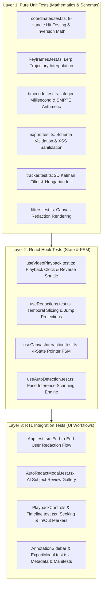

# Testing Strategy, Test Pyramid & Continuous Integration Gates

> **Components:** `tests/`, `vitest.config.ts`, `.github/workflows/ci.yml`  
> **Target Audience:** QA Leads, Staff Engineers & Open-Source Maintainers  
> **Master Architecture:** [docs/ARCHITECTURE.md](ARCHITECTURE.md)

---

## 1. Executive Summary

In public safety and forensic evidence review software, bugs or mathematical coordinate drift can result in evidence suppression, privacy disclosure breaches, or courtroom challenges. Consequently, **canvas-redact** operates under a **Zero Untested Code** mandate:
* **Comprehensive Test Suite:** 19 automated test suites with 162 unit and integration tests executing in under 3 seconds.
* **Strict TypeScript Type-Checking:** `tsc --noEmit` runs with zero diagnostic errors permitted.
* **Automated CI Gates:** Every push to `main` and every pull request must pass a deterministic continuous integration pipeline running on `ubuntu-latest`.

---

## 2. Three-Layer Test Pyramid



---

## 3. Test Coverage Matrix

| Test Suite | Layer | Test Cases | Execution Time | Focus & Invariants Covered |
| :--- | :--- | :--- | :--- | :--- |
| `tests/unit/coordinates.test.ts` | Unit | 14 tests | ~5 ms | Handle inversion math, screen-to-normalized conversions, micro-drag suppression |
| `tests/unit/keyframes.test.ts` | Unit | 16 tests | ~9 ms | Piecewise linear interpolation (`lerp`), boundary clamping, anchor seeding |
| `tests/unit/timecode.test.ts` | Unit | 14 tests | ~4 ms | SMPTE timecode formatting, integer millisecond math, frame-stepping clamping |
| `tests/unit/export.test.ts` | Unit | 10 tests | ~13 ms | Schema `v1.0.0` validation, label XSS sanitization, coordinate clamping |
| `tests/unit/tracker.test.ts` | Unit | 14 tests | ~8 ms | Kalman filter state transitions, constant-velocity predictions, Hungarian IoU |
| `tests/unit/filters.test.ts` | Unit | 7 tests | ~16 ms | Gaussian blur clipping, mosaic pixelation scratch buffer, blackout drawing |
| `tests/hooks/useRedactions.test.ts` | Hook | 11 tests | ~27 ms | Forward-projected jump extensions, temporal slicing, keyframe CRUD |
| `tests/hooks/useVideoPlayback.test.ts`| Hook | 7 tests | ~32 ms | Hardware video clock synchronization, reverse shuttle, monotonic frame steps |
| `tests/hooks/useCanvasInteraction.test.ts`| Hook | 7 tests | ~31 ms | 4-state FSM transitions, window listener lifecycles, cursor style mapping |
| `tests/hooks/useAutoDetection.test.ts`| Hook | 4 tests | ~11 ms | Scanning state machine, cancelation, trajectory synthesis |
| `tests/components/App.test.tsx` | RTL | 9 tests | ~970 ms | Global keyboard hotkey orchestration (`Space`, `T`, `J/K/L`, `[`/`]`) |
| `tests/components/AutoRedactModal.test.tsx`| RTL | 12 tests | ~690 ms | Subject gallery review, selective checkbox toggling, treatment selectors |
| `tests/components/Timeline.test.tsx` | RTL | 6 tests | ~140 ms | Playhead dragging, in/out bracket dragging, keyframe diamonds |
| `tests/components/PlaybackControls.test.tsx`| RTL | 7 tests | ~260 ms | Play/pause toggles, shuttle speed indicators, jump frame selector |
| `tests/components/Header.test.tsx` | RTL | 9 tests | ~260 ms | Local file drag-and-drop ingestion, Reviewer ID badge editing |
| `tests/components/AnnotationSidebar.test.tsx`| RTL | 4 tests | ~260 ms | Redaction metadata inspector, label editing, treatment switching |
| `tests/components/ExportModal.test.tsx`| RTL | 4 tests | ~70 ms | Evidence JSON generation, clipboard copying, file download |

**Total:** 19 test suites, 162 automated tests passing with zero warnings or failures.

---

## 4. Mocking Contracts for Browser Graphics & Media APIs

In headless test environments (Node.js + jsdom), HTML5 Video and Canvas 2D contexts do not exist natively. `tests/setup.ts` establishes standardized mock contracts:

### 4.1 HTMLCanvasElement 2D Graphics Context Mock
```typescript
class MockCanvasRenderingContext2D {
  save = vi.fn();
  restore = vi.fn();
  beginPath = vi.fn();
  rect = vi.fn();
  clip = vi.fn();
  fillRect = vi.fn();
  strokeRect = vi.fn();
  fillText = vi.fn();
  drawImage = vi.fn();
  setTransform = vi.fn();
  filter = 'none';
  imageSmoothingEnabled = true;
}
```

### 4.2 HTML5 `<video>` Playback Clock Mock
Simulates native video hardware properties:
* `currentTime`, `duration`, `paused`, `playbackRate`, `videoWidth`, `videoHeight`.
* Event dispatching for `'play'`, `'pause'`, `'timeupdate'`, `'seeked'`, and `'loadedmetadata'`.

---

## 5. Continuous Integration Pipeline (`.github/workflows/ci.yml`)

Every pull request and commit to `main` must pass through a strict four-stage CI workflow on `ubuntu-latest`:

```yaml
name: CI
on:
  push:
    branches: [main]
  pull_request:
    branches: [main]

jobs:
  validate:
    name: Typecheck, Test & Build
    runs-on: ubuntu-latest
    steps:
      - name: Checkout Repository
        uses: actions/checkout@v4

      - name: Setup Node.js LTS
        uses: actions/setup-node@v4
        with:
          node-version: 22
          cache: 'npm'

      - name: Install Dependencies
        run: npm ci

      - name: Strict Typecheck
        run: npm run typecheck

      - name: Run Automated Vitest Suites
        run: npm test

      - name: Production Bundle Compilation
        run: npm run build
```

---

## 6. Local Pre-CI Verification Script

Engineers and automated sub-agents run the full local verification sequence before staging any commit:

```bash
npm run typecheck && npm test && npm run build
```
